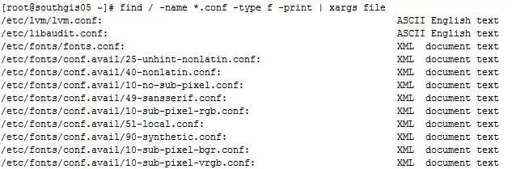
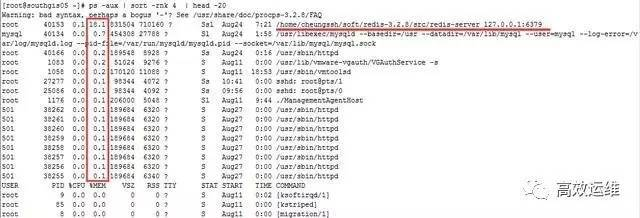
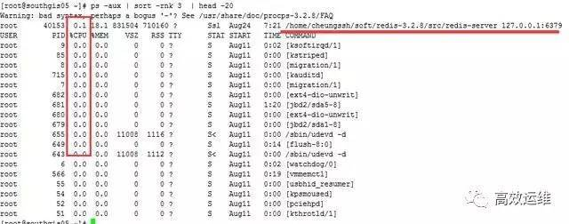
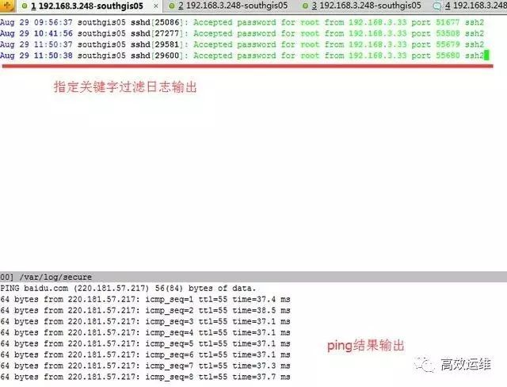
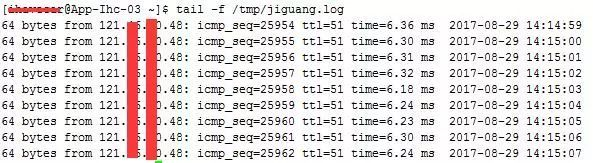
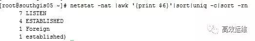
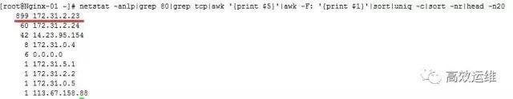

## 例1：找出 / 目录下以 .conf 结尾的文件，并进行文件分类

`# find / -name '*.conf' -type f -print | xargs file`

输出结果如下所示：

xargs 后面不仅仅可以加文件分类的命令，你还可以加其他的很多命令，比如说实在一点的tar命令，你可以使用find命令配合tar命令，将指定路径的特殊文件使用find命令找出来，然后配合tar命令将找出的文件直接打包，命令如下：

`# find / -name '*.conf' -type f -print | xargs tar cjf test.tar.gz`

## 命令或脚本后台运行

比如说我们想把数据库的导出操作后台运行，并且将命令的操作输出记录到文件，那么我们可以这么做：

`nohup mysqldump -uroot -pxxxxx —all-databases > ./alldatabases.sql &（xxxxx是密码）`

当然如果你不想密码明文，你还可以这么做：

`nohup mysqldump -uroot -pxxxxx —all-databases > ./alldatabases.sql （后面不加&符号）`

执行了上述命令后，会提示叫你输入密码，输入密码后，该命令还在前台运行，但是我们的目的是后台运行该命令，这个时候你可以按下 `Ctrl+Z`，然后在输入 `bg` 就可以达到第一个命令的效果，让该命令后台运行，同时也可以让密码隐蔽输入。

命令后台执行的结果会在命令执行的当前目录下留下一个 `nohup.out` 文件，查看这个文件就知道命令有没有执行报错等信息。

## 找出当前系统内存使用量较高的进程

在很多运维的时候，我们发现内存耗用较为严重，那么怎么样才能找出内存消耗的进程排序呢？

`# ps -aux | sort -rnk 4 | head -20`

输出的第4列就是内存的耗用百分比。最后一列就是相对应的进程。

## 找出当前系统CPU使用量较高的进程

在很多运维的时候，我们发现CPU耗用较为严重，那么怎么样才能找出CPU消耗的进程排序呢？

`# ps -aux | sort -rnk 3 | head -20`

输出的第3列为CPU的耗用百分比，最后一列就是对应的进程。

我想大家应该也发现了，sort 命令后的3、4其实就是代表着第3列进行排序、第4列进行排序。

## 同时查看多个日志或数据文件

有个工具叫做 `multitail` 可以在同一个终端同时查看多个日志文件。

- [multitail 在 Ubuntu 安装及使用文档](https://linuxhint.com/install-multitail-ubuntu/)

`multitail` 工具支持文本的高亮显示，内容过滤以及更多你可能需要的功能。

此时我们既想查看secure的日志指定过滤关键字输出，又想查看实时的网络ping情况：

`# multitail -e "Accepted" /var/log/secure -l "ping baidu.com"`

是不是很方便？如果平时我们想查看两个日志之间的关联性，可以观察日志输出是否有触发等。如果分开两个终端可能来回进行切换有点浪费时间，这个multitail工具查看未尝不是一个好方法。

## 持续ping并将结果记录到日志

很多时候，运维总会听到一个声音，是不是网络出什么问题了啊，导致业务出现怪异的症状，肯定是服务器网络出问题了。这个就是俗称的背锅，业务出了问题，第一时间相关人员找不到原因很多情况下就会把问题归结于服务器网络有问题。

这个时候你去ping几个包把结果丢出来，人家会反驳你，刚刚那段时间有问题而已，现在业务都恢复正常了，网络肯定正常啊，这个时候估计你要气死。

你要是再拿出zabbix等网络监控的数据，这个时候就不太妥当了，zabbix的采集数据间隔你不可能设置成1秒钟1次吧？小编就遇到过这样的问题，结果我通过以下的命令进行了ping监控采集。

然后再有人让我背锅的时候，我把出问题时间段的ping数据库截取出来，大家公开谈，结果那次被我叼杠回去了，以后他们都不敢轻易甩锅了，这个感觉好啊。

命令：

`ping api.jpush.cn | awk ‘{ print $0”    “ strftime(“%Y-%m-%d %H:%M:%S”,systime()) } ‘ >> /tmp/jiguang.log &`

输出的结果会记录到/tmp/jiguang.log 中，每秒钟新增一条ping记录，如下：

## 查看tcp连接状态

`# netstat -nat |awk '{print $6}'|sort|uniq -c|sort -rn `

## 查找80端口请求数最高的前20个IP

有时候业务的请求量突然上去了，那么这个时候我们可以查看下请求来源IP情况，如果是集中在少数IP上的，那么可能是存在攻击行为，我们使用防火墙就可以进行封禁。命令如下：

`# netstat -anlp|grep 80|grep tcp|awk '{print $5}'|awk -F: '{print $1}'|sort|uniq -c|sort -nr|head -n20`

## ssh实现端口转发

可能很多的朋友都听说过ssh是linux下的远程登录安全协议，就是通俗的远程登录管理服务器。但是应该很少朋友会听说过ssh还可以做端口转发。其实ssh用来做端口转发的功能还是很强大的，下面就来做示范。

实例背景：我们公司是有堡垒机的，任何操作均需要在堡垒机上进行，有写开发人员需要访问ELasticSearch的head面板查看集群状态，但是我们并不想将ElasticSearch的9200端口映射出去，依然想通过堡垒机进行访问。所以才会将通往堡垒机（192.168.1.15）的请求转发到服务器ElasticSearch（192.168.1.19）的9200上。

例子：

将发往本机（192.168.1.15）的9200端口访问转发到192.168.1.19的9200端口

`ssh -p 22 -C -f -N -g -L 9200:192.168.1.19:9200 ihavecar@192.168.1.19`

记住：前提是先进行秘钥传输。

命令执行完后，访问192.168.1.15:9200端口则真实是访问192.168.1.19:9200端口。