下面是我们安装时用到的架构图
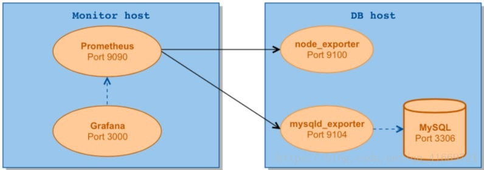

## 安装 prometheus

查看最新版本：https://github.com/prometheus/prometheus/releases

```bash
wget https://github.com/prometheus/prometheus/releases/download/v2.10.0/prometheus-2.10.0.linux-amd64.tar.gz
tar xvf prometheus-2.10.0.linux-amd64.tar.gz
cd prometheus-1.6.2.linux-amd64
```

解压后的目录结构：

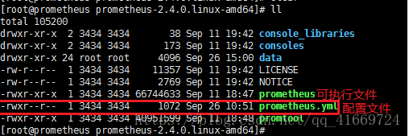

修改 Prometheus 配置文件 prometheus.yml （替换你要监控的IP地址）：

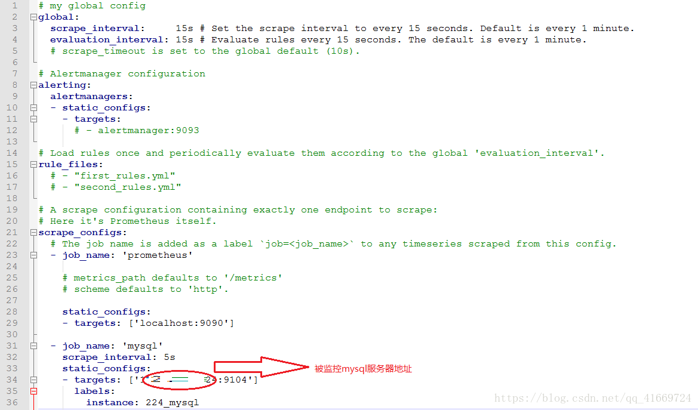

其中 targets:['IP:Port']，IP是我们数据库主机的IP，端口则是对应的exporter的监听端口。

- 端口默认是`9104`，因为`mysqld_exporter`默认监听`9104`
- 这个版本似乎不支持labels，我删了正常运行

启动Prometheus(要注意 prometheus.yml 配置文件的位置，下面的命令是在 可执行文件prometheus 同级目录下)

`./prometheus --config.file=prometheus.yml`

Prometheus启动后可以访问web界面，我们可通过`http://monitor_host:9090`进行访问进行访问：

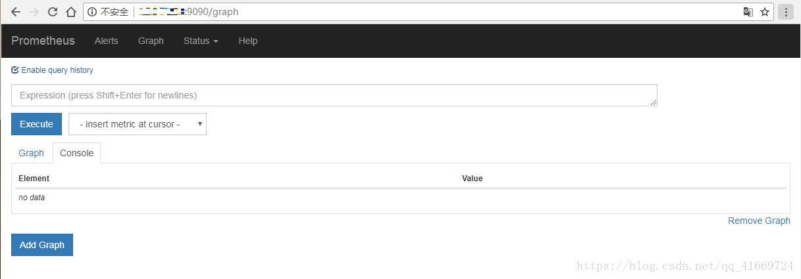

在Status->Targets页面下，我们可以看到我们配置的Target，它们的State为DOWN。

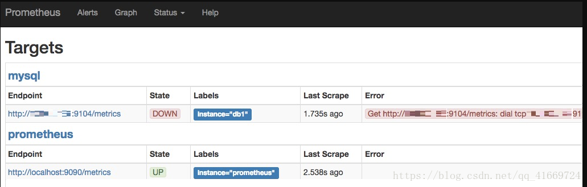

下一步我们需要安装并运行exporter，下载exporters并解压到被监控端服务器（注意：exporter是安装在被检测的服务器上）：

查看最新版本：https://github.com/prometheus/mysqld_exporter/releases/

```bash
wget https://github.com/prometheus/mysqld_exporter/releases/download/v0.11.0/mysqld_exporter-0.11.0.linux-amd64.tar.gz
tar xvf mysqld_exporter-0.11.0.linux-amd64.tar.gz
```

安装运行mysqld_exporter

创建.my.cnf文件并运行mysqld_exporter：

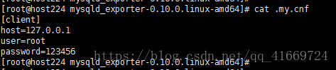

`./mysqld_exporter --config.my-cnf .my.cnf`

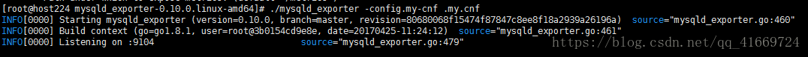

然后再返回到监控的页面查看状态：

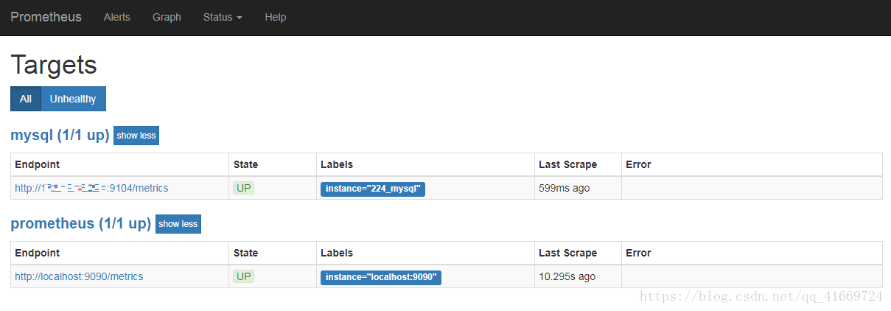

## 安装运行Grafana

这个是安装到监控服务器上

1、apt 安装

```bash
sudo touch /etc/apt/sources.list.d/grafana.list
sudo echo 'deb https://packages.grafana.com/oss/deb stable main' > /etc/apt/sources.list.d/grafana.list
curl https://packages.grafana.com/gpg.key | sudo apt-key add -
sudo apt-get update
sudo apt-get install grafana
```

运行grafana并登陆，启动grafana

```bash
sudo systemctl start grafana-server
sudo systemctl enable grafana-server
```

启动后查看状态：

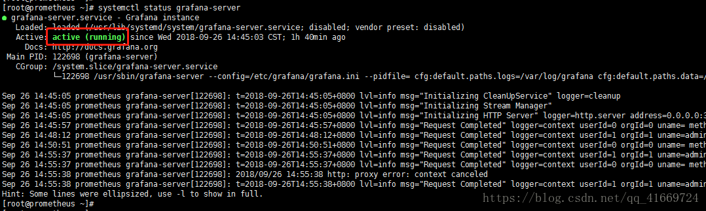

启动后访问 http://monitor_host:3000进行访问进行访问，用户名、密码：admin/admin

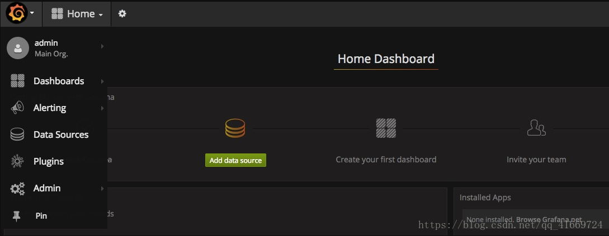

点击添加数据源，然后选择prometheus：

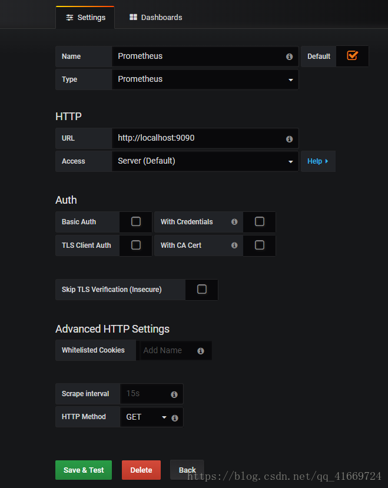

点击保存，然后添加grafana的监控规则

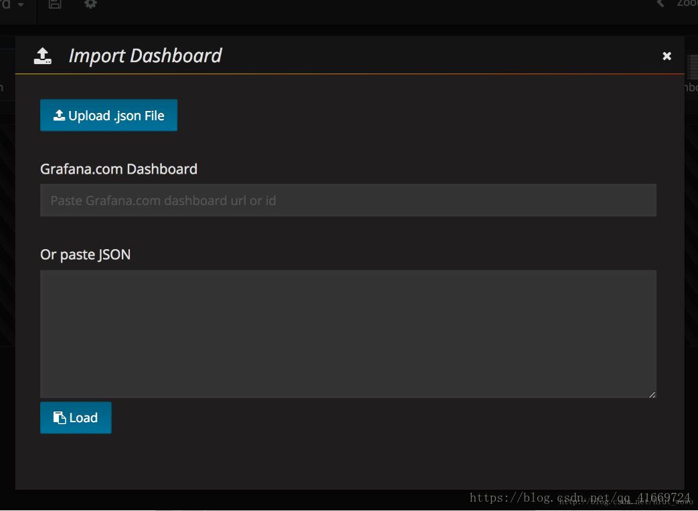

这里你需要从 https://github.com/percona/grafana-dashboards 项目中的 dashboards 下载M ySQL_Overview.json，然后通过上面页面的 Upload .json File 按钮上传上去，导入即可

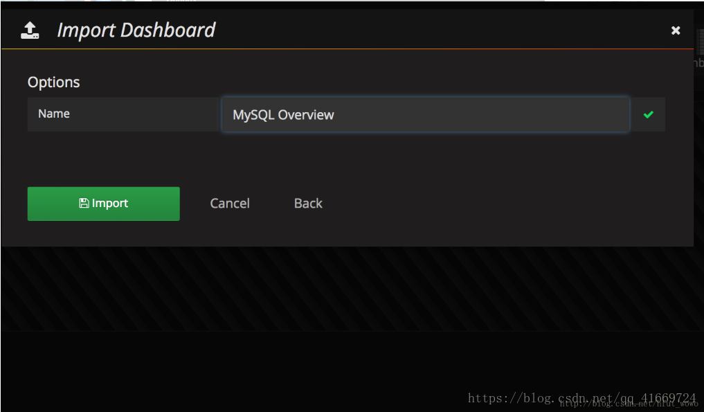

导入成功后，你将看到监控页面。

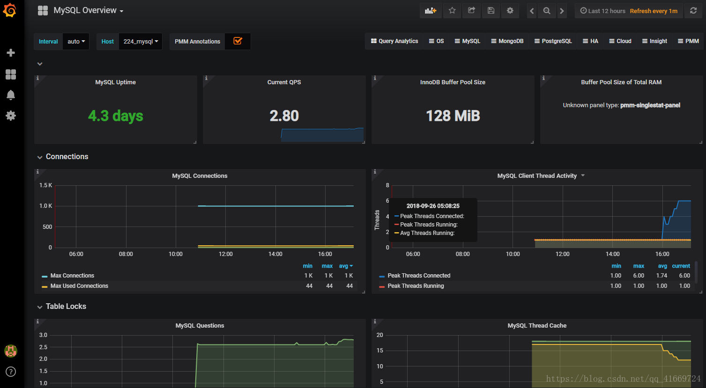

参考资料：

- [Prometheus官网的非官方中文手册](https://www.kancloud.cn/cdh0805010118/prometheus/719339)
- [《Prometheus-book》](https://github.com/yunlzheng/prometheus-book)
- [《Prometheus 实战》](https://songjiayang.gitbooks.io/prometheus/content/)