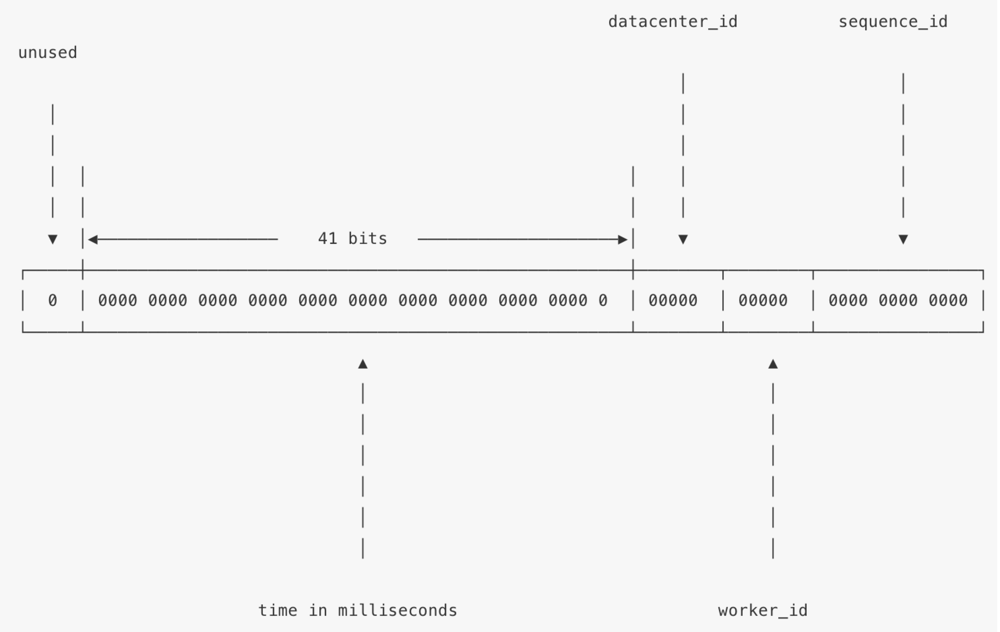

Twitter 的 snowflake 在分布式生成唯一 UUID 应用还是蛮广泛的，基于 snowflake 的一些变种的算法网上也有不少。使用 snowflake 生成 UUID 很多都是在分布式场景下使用，我看了下网上有其中有几篇 PHP 实现的都没有考虑到线程安全。现在 PHP 有了 Swoole 的锁和协程的加持，对于我们开发线程安全和高并发模拟还是很方便的，这里用 PHP 结合 Swoole 来学习下实现最简单的 snowflake（好久没写 PHP，感觉没有 IDE 真写不了 PHP 了）。

先来看以下 snowflake 的结构：



生成的数值是 64 位，分成 4 个部分：

- 第一个 bit 为符号位，最高位为 0 表示正数
- 第二部分 41 个 bit 用于记录生成 ID 时候的时间戳，单位为毫秒，所以该部分表示的数值范围为 2^41 - 1（69 年），它是相对于某一时间的偏移量
- 第三部分的 10 个 bit 表示工作节点的 ID，表示数值范围为 2^10 - 1，相当于支持 1024 个节点
- 第四部分 12 个 bit 表示每个工作节点没毫秒生成的循环自增 id，最多可以生成 2^12 -1 个 id，超出归零等待下一毫秒重新自增

先贴下代码:

```php
<?php

class Snowflake
{
    const EPOCH = 1543223810238;    // 起始时间戳，毫秒

    const SEQUENCE_BITS = 12;   //序号部分12位
    const SEQUENCE_MAX = -1 ^ (-1 << self::SEQUENCE_BITS);  // 序号最大值

    const WORKER_BITS = 10; // 节点部分10位
    const WORKER_MAX = -1 ^ (-1 << self::WORKER_BITS);  // 节点最大数值

    const TIME_SHIFT = self::WORKER_BITS + self::SEQUENCE_BITS; // 时间戳部分左偏移量
    const WORKER_SHIFT = self::SEQUENCE_BITS;   // 节点部分左偏移量

    protected $timestamp;   // 上次ID生成时间戳
    protected $workerId;    // 节点ID
    protected $sequence;    // 序号
    protected $lock;        // Swoole 互斥锁

    public function __construct($workerId)
    {
        if ($workerId < 0 || $workerId > self::WORKER_MAX) {
            trigger_error("Worker ID 超出范围");
            exit(0);
        }

        $this->timestamp = 0;
        $this->workerId = $workerId;
        $this->sequence = 0;
        $this->lock = new swoole_lock(SWOOLE_MUTEX);
    }

    /**
     * 生成ID
     * @return int
     */
    public function getId()
    {
        $this->lock->lock();    // 这里一定要记得加锁
        $now = $this->now();
        if ($this->timestamp == $now) {
            $this->sequence++;

            if ($this->sequence > self::SEQUENCE_MAX) {
                // 当前毫秒内生成的序号已经超出最大范围，等待下一毫秒重新生成
                while ($now <= $this->timestamp) {
                    $now = $this->now();
                }
            }
        } else {
            $this->sequence = 0;
        }

        $this->timestamp = $now;    // 更新ID生时间戳

        $id = (($now - self::EPOCH) << self::TIME_SHIFT) | ($this->workerId << self::WORKER_SHIFT) | $this->sequence;
        $this->lock->unlock();  //解锁

        return $id;
    }

    /**
     * 获取当前毫秒
     * @return string
     */
    public function now()
    {
        return sprintf("%.0f", microtime(true) * 1000);
    }

}
```

其实逻辑并不复杂，解释一下代码中的位运算：

```
-1 ^ (-1 << self::SEQUENCE_BITS)
就是-1的二进制表示为1的补码,其实等同于 :
2**self::SEQUENCE_BITS - 1
```

最后部分左移后或运算：

```php
(($now - self::EPOCH) << self::TIME_SHIFT) | ($this->workerId << self::WORKER_SHIFT) | $this->sequence;
```

这里主要是对除了第一位符号位以外的三个部分进行左移相应的偏移量使其归位，并通过或运算重新整合成上面 snowflake 的结构，比如我们用 3 部分 4 位来演示一下该归并操作:

```
0000 0000 0010  --左移0位--> 0000 0000 0010
0000 0000 0100  --左移4位--> 0000 0100 0000 --或操作-->1000 0100 0010
0000 0000 1000  --左移8位--> 1000 0000 0000
```

下面借助 Swoole 的协程和 channel 来暴力测试一下，看看生成的 ID 是否会出现重复的状况:

```php
$snowflake = new Snowflake(1);

$chan = new chan(100000);
$n = 100000;

for ($i = 0; $i < $n; $i++) {
    go(function () use ($snowflake, $chan) {
        $id = $snowflake->getId();
        $chan->push($id);
    });
}

go(function () use ($chan, $n) {
    $arr = [];
    for ($i = 0; $i < $n; $i++) {
        $id = $chan->pop();
        if (in_array($id, $arr)) {
            exit("ID 已存在");
        }
        array_push($arr, $id);
    }
});

$chan->close();

echo "ok";
```

跑了一下，确实不会出现重复的 ID，对了，我用 Golang 同样实现了 snowflake 并协程序方式跑了同样的测试，PHP 的执行时间是大约 12 秒左右，Golang 只需要 1 秒。文章有什么错误还请指正，谢谢。