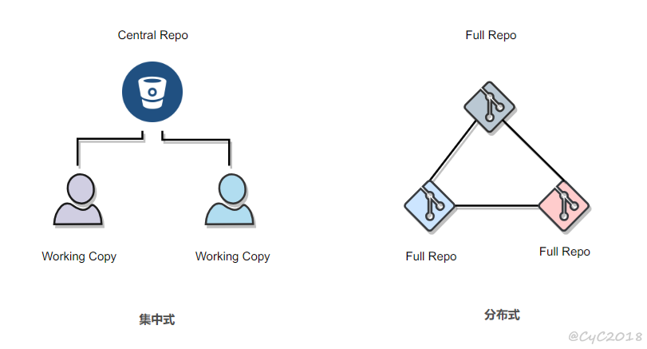
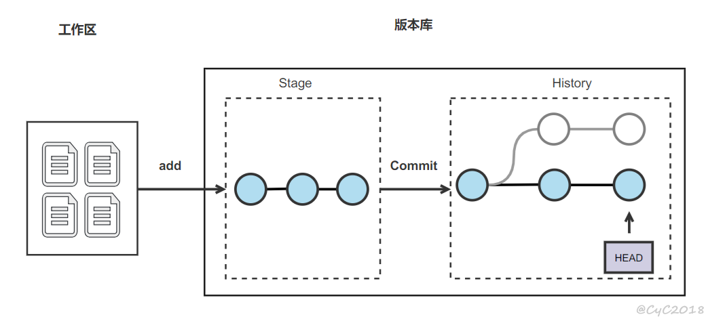
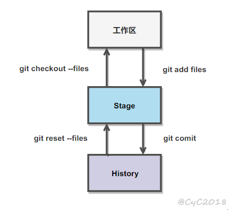
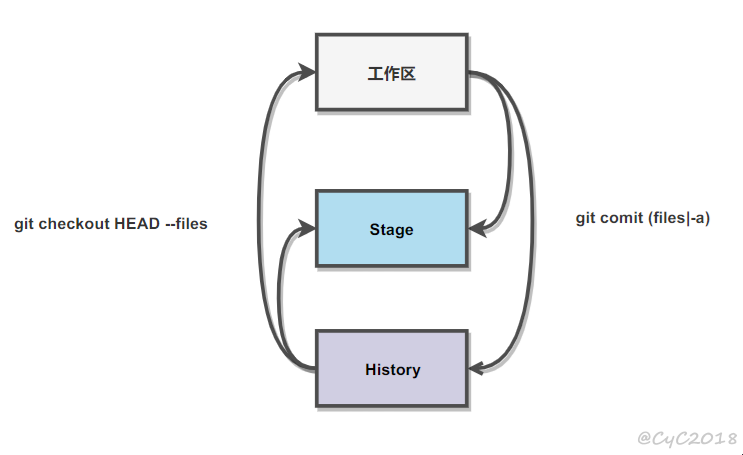
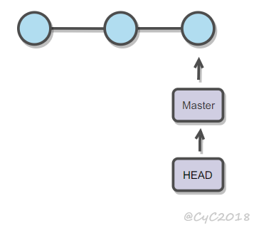
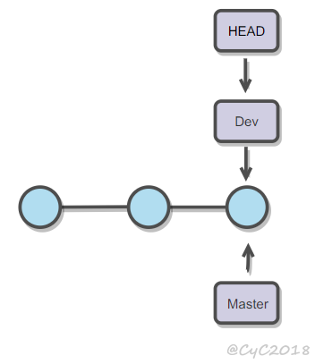
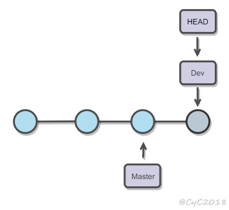
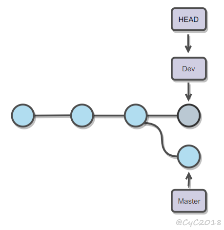
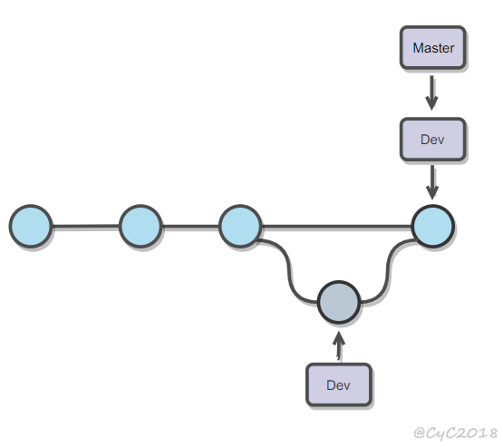
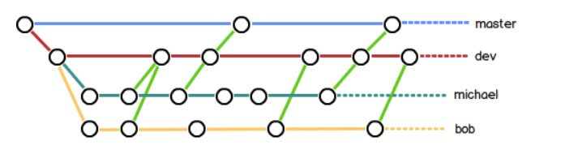

<!-- GFM-TOC -->
* [集中式与分布式](#集中式与分布式)
* [中心服务器](#中心服务器)
* [工作流](#工作流)
* [分支实现](#分支实现)
* [冲突](#冲突)
* [Fast forward](#fast-forward)
* [分支管理策略](#分支管理策略)
* [储藏（Stashing）](#储藏stashing)
* [SSH 传输设置](#ssh-传输设置)
* [.gitignore 文件](#gitignore-文件)
* [Git 命令一览](#git-命令一览)
* [参考资料](#参考资料)
<!-- GFM-TOC -->


# 集中式与分布式

Git 属于分布式版本控制系统，而 SVN 属于集中式。



集中式版本控制只有中心服务器拥有一份代码，而分布式版本控制每个人的电脑上就有一份完整的代码。

集中式版本控制有安全性问题，当中心服务器挂了所有人都没办法工作了。

集中式版本控制需要连网才能工作，如果网速过慢，那么提交一个文件的会慢的无法让人忍受。而分布式版本控制不需要连网就能工作。

分布式版本控制新建分支、合并分支操作速度非常快，而集中式版本控制新建一个分支相当于复制一份完整代码。

# 中心服务器

中心服务器用来交换每个用户的修改，没有中心服务器也能工作，但是中心服务器能够 24 小时保持开机状态，这样就能更方便的交换修改。

Github 就是一个中心服务器。

# 工作流

新建一个仓库之后，当前目录就成为了工作区，工作区下有一个隐藏目录 .git，它属于 Git 的版本库。

Git 的版本库有一个称为 Stage 的暂存区以及最后的 History 版本库，History 中存有所有分支，使用一个 HEAD 指针指向当前分支。



- git add files 把文件的修改添加到暂存区
- git commit 把暂存区的修改提交到当前分支，提交之后暂存区就被清空了
- git reset -- files 使用当前分支上的修改覆盖暂存区，用来撤销最后一次 git add files
- git checkout -- files 使用暂存区的修改覆盖工作目录，用来撤销本地修改



可以跳过暂存区域直接从分支中取出修改，或者直接提交修改到分支中。

- git commit -a 直接把所有文件的修改添加到暂存区然后执行提交
- git checkout HEAD -- files 取出最后一次修改，可以用来进行回滚操作



# 分支实现

使用指针将每个提交连接成一条时间线，HEAD 指针指向当前分支指针。



新建分支是新建一个指针指向时间线的最后一个节点，并让 HEAD 指针指向新分支表示新分支成为当前分支。



每次提交只会让当前分支指针向前移动，而其它分支指针不会移动。



合并分支也只需要改变指针即可。


# 冲突

当两个分支都对同一个文件的同一行进行了修改，在分支合并时就会产生冲突。



Git 会使用 <<<<<<< ，======= ，>>>>>>> 标记出不同分支的内容，只需要把不同分支中冲突部分修改成一样就能解决冲突。

```
<<<<<<< HEAD
Creating a new branch is quick & simple.
=======
Creating a new branch is quick AND simple.
>>>>>>> feature1
```

# Fast forward

"快进式合并"（fast-farward merge），会直接将 master 分支指向合并的分支，这种模式下进行分支合并会丢失分支信息，也就不能在分支历史上看出分支信息。

可以在合并时加上 --no-ff 参数来禁用 Fast forward 模式，并且加上 -m 参数让合并时产生一个新的 commit。

```bash
git merge --no-ff -m "merge with no-ff" dev  # 将dev分支合并到当前分支
git mergetool --tool=meld  # 用meld图形化工具解决冲突
```



# 分支管理策略

master 分支应该是非常稳定的，只用来发布新版本；

日常开发在开发分支 dev 上进行。



```bash
git log --pretty=format:"%h %s" --graph     #这个选项添加了一些ASCII字符串来形象地展示你的分支、合并历史
```

# 储藏（Stashing）

在一个分支上操作之后，如果还没有将修改提交到分支上，此时进行切换分支，那么另一个分支上也能看到新的修改。这是因为所有分支都共用一个工作区的缘故。

可以使用 git stash 将当前分支的修改储藏起来，此时当前工作区的所有修改都会被存到栈上，也就是说当前工作区是干净的，没有任何未提交的修改。此时就可以安全的切换到其它分支上了。

```bash
$ git stash
Saved working directory and index state \ "WIP on master: 049d078 added the index file"
HEAD is now at 049d078 added the index file (To restore them type "git stash apply")
```

该功能可以用于 bug 分支的实现。如果当前正在 dev 分支上进行开发，但是此时 master 上有个 bug 需要修复，但是 dev 分支上的开发还未完成，不想立即提交。在新建 bug 分支并切换到 bug 分支之前就需要使用 git stash 将 dev 分支的未提交修改储藏起来。

```bash
git stash # 保存当前工作进度，会把暂存区和工作区的改动保存起来。执行完这个命令后，在运行git status命令，就会发现当前是一个干净的工作区，没有任何改动。使用 git stash save 'message...' 可以添加一些注释
git stash list # 显示保存进度的列表。也就意味着，git stash 命令可以多次执行。
git stash pop # 恢复最新的进度到工作区。git默认会把工作区和暂存区的改动都恢复到工作区。
git stash pop --index # 恢复最新的进度到工作区和暂存区。（尝试将原来暂存区的改动还恢复到暂存区）
git stash pop stash@{1} # 恢复指定的进度到工作区。stash_id 是通过 git stash list 命令得到的。通过 git stash pop 命令恢复进度后，会删除当前进度。
git stash apply [–index] [stash_id] # 除了不删除恢复的进度之外，其余和 git stash pop 命令一样。
git stash drop [stash_id] # 删除一个存储的进度。如果不指定stash_id，则默认删除最新的存储进度。
git stash clear # 删除所有存储的进度。
```

# SSH 传输设置

Git 仓库和 Github 中心仓库之间的传输是通过 SSH 加密。

如果工作区下没有 .ssh 目录，或者该目录下没有 id_rsa 和 id_rsa.pub 这两个文件，可以通过以下命令来创建 SSH Key：

```bash
$ ssh-keygen -t rsa -C "youremail@example.com"
```

然后把公钥 id_rsa.pub 的内容复制到 Github "Account settings" 的 SSH Keys 中。

# .gitignore 文件

忽略以下文件：

- 操作系统自动生成的文件，比如缩略图；
- 编译生成的中间文件，比如 Java 编译产生的 .class 文件；
- 自己的敏感信息，比如存放口令的配置文件。

不需要全部自己编写，可以到 [https://github.com/github/gitignore](https://github.com/github/gitignore) 中进行查询。

# Git 命令一览


比较详细的地址：[git-cheat-sheet.pdf](../images/git/git-cheat-sheet.pdf)

# 参考资料

- [Git - 简明指南](http://rogerdudler.github.io/git-guide/index.zh.html)
- [图解 Git](http://marklodato.github.io/visual-git-guide/index-zh-cn.html)
- [廖雪峰 : Git 教程](https://www.liaoxuefeng.com/wiki/0013739516305929606dd18361248578c67b8067c8c017b000)
- [在线动态学习GIT操作（荐）](https://learngitbranching.js.org/)
