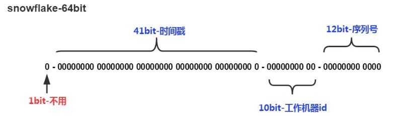

## 方法一：UUID

`UUID` 是通用唯一识别码 (Universally Unique Identifier)，在其他语言中也叫 `GUID` ，可以生成一个长度 `32位` 的全局唯一识别码。

`String uuid = UUID.randomUUID().toString()`

结果示例：

`046b6c7f-0b8a-43b9-b35d-6489e6daee91`


为什么无序的UUID会导致入库性能变差呢？

这就涉及到 `B+树索引的分裂`：


众所周知，关系型数据库的索引大都是B+树的结构，拿ID字段来举例，索引树的每一个节点都存储着若干个ID。

如果我们的ID按递增的顺序来插入，比如陆续插入8，9，10，新的ID都只会插入到最后一个节点当中。当最后一个节点满了，会裂变出新的节点。这样的插入是性能比较高的插入，因为这样节点的分裂次数最少，而且充分利用了每一个节点的空间。


但是，如果我们的插入完全无序，不但会导致一些中间节点产生分裂，也会白白创造出很多不饱和的节点，这样大大降低了数据库插入的性能。

## 方法二：数据库自增主键

假设名为table的表有如下结构：

```
id feild

35 a
```

每一次生成ID的时候，访问数据库，执行下面的语句：

```sql
begin;

REPLACE INTO table ( feild ) VALUES ( 'a' );

SELECT LAST_INSERT_ID();

commit;
```

`REPLACE INTO` 的含义是插入一条记录，如果表中唯一索引的值遇到冲突，则替换老数据。

这样一来，每次都可以得到一个递增的ID。

为了提高性能，在分布式系统中可以用 `DB proxy` 请求不同的分库，每个分库设置不同的初始值，步长和分库数量相等：


这样一来，DB1生成的ID是1,4,7,10,13....，DB2生成的ID是2,5,8,11,14.....


## 目前流行的方式 SnowFlake

snowflake算法所生成的ID结构是什么样子呢？我们来看看下图：



SnowFlake所生成的ID一共分成四部分：

- 1.第一位

占用1bit，其值始终是0，没有实际作用。

- 2.时间戳

占用41bit，精确到毫秒，总共可以容纳约69 年的时间。

- 3.工作机器id

占用10bit，其中高位5bit是数据中心ID（datacenterId），低位5bit是工作节点ID（workerId），做多可以容纳1024个节点。

- 4.序列号

占用12bit，这个值在同一毫秒同一节点上从0开始不断累加，最多可以累加到4095。

SnowFlake算法在同一毫秒内最多可以生成多少个全局唯一ID呢？只需要做一个简单的乘法：

`同一毫秒的ID数量 = 1024 X 4096 = 4194304`

这个数字在绝大多数并发场景下都是够用的。

SnowFlake的代码实现：

- [>>>>> PHP实现Snowflake生成分布式唯一ID](https://github.com/Tinyming-GO/Notes/tree/master/Php/PHP实现Snowflake生成分布式唯一ID.md)

有几点需要解释一下：

1.获得单一机器的下一个序列号，使用Synchronized控制并发，而非CAS的方式，是因为CAS不适合并发量非常高的场景。

2.如果当前毫秒在一台机器的序列号已经增长到最大值4095，则使用while循环等待直到下一毫秒。

3.如果当前时间小于记录的上一个毫秒值，则说明这台机器的时间回拨了，抛出异常。但如果这台机器的系统时间在启动之前回拨过，那么有可能出现ID重复的危险。

SnowFlake的优势和劣势:

- SnowFlake算法的优点：

1.生成ID时不依赖于DB，完全在内存生成，高性能高可用。

2.ID呈趋势递增，后续插入索引树的时候性能较好。

- SnowFlake算法的缺点：

依赖于系统时钟的一致性。如果某台机器的系统时钟回拨，有可能造成ID冲突，或者ID乱序。
