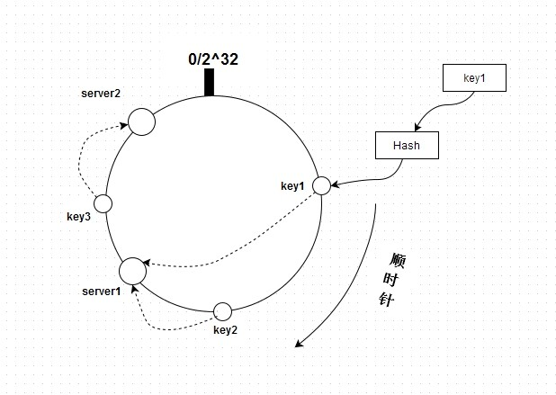
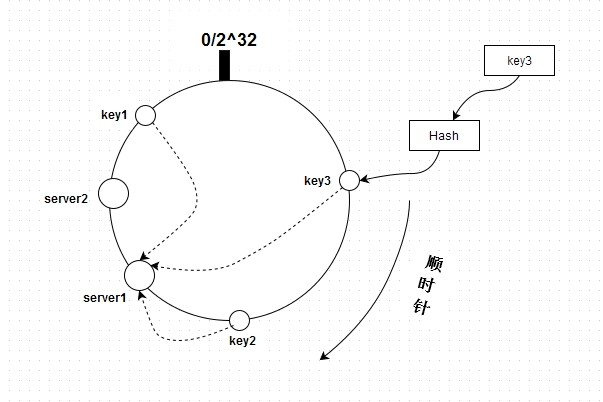

分布式缓存策略：

## 哈希(Hash)

Hash，一般翻译做“散列”，也有直接音译为"哈希"的，就是把任意长度的输入（又叫做预映射， pre-image），通过散列算法，变换成固定长度的输出，该输出就是散列值。这种转换是一种压缩映射，也就是散列值的空间通常远小于输入的空间，不同的输入可能会散列成相同的输出，而不可能从散列值来唯一的确定输入值。

简单的说就是一种将任意长度的消息压缩到某一固定长度的消息摘要的函数。

目前普遍采用的哈希算法是time33，又称DJBX33A (Daniel J. Bernstein, Times 33 with Addition)。这个算法被广泛运用于多个软件项目，Apache、Perl和Berkeley DB等。对于字符串而言这是目前所知道的最好的哈希算法，原因在于该算法的速度非常快，而且分类非常好(冲突小，分布均匀)。

PHP内核就采用了time33算法来实现HashTable，来看下time33的定义：

`hash(i) = hash(i-1) * 33 + str[i]`

有了定义就容易实现了：

```PHP
<?php
function myHash($str) {
	// hash(i) = hash(i-1) * 33 + str[i]
	$hash = 0;
	$s    = md5($str);
	$seed = 5;
	$len  = 32;
	for ($i = 0; $i < $len; $i++) {
		// (hash << 5) + hash 相当于 hash * 33
		//$hash = sprintf("%u", $hash * 33) + ord($s{$i});
		//$hash = ($hash * 33 + ord($s{$i})) & 0x7FFFFFFF;
		$hash = ($hash << $seed) + $hash + ord($s{$i});  //TODO 网上常见，不过仅限于php5.6.0以上版本
        //$hash = ($hash << $seed) + ord($s{$i});  //TODO php5.6.0以下，可以使用这个方法，测试效果不错
	}

	return $hash & 0x7FFFFFFF;
}

echo myHash("却道天凉好个秋~");
```
```bash
$ php -f test.php
530413806
```

## 策略一： 利用取模实现(不建议使用)

现在有2台redis server，所以需要计算键的hash并跟2取模。比如有键key1和key2，代码如下：

```php
<?php
function myHash($str) {
	// hash(i) = hash(i-1) * 33 + str[i]
	$hash = 0;
	$s    = md5($str);
	$seed = 5;
	$len  = 32;
	for ($i = 0; $i < $len; $i++) {
		// (hash << 5) + hash 相当于 hash * 33
		//$hash = sprintf("%u", $hash * 33) + ord($s{$i});
		//$hash = ($hash * 33 + ord($s{$i})) & 0x7FFFFFFF;
		$hash = ($hash << $seed) + $hash + ord($s{$i});  //TODO 网上常见，不过仅限于php5.6.0以上版本
        //$hash = ($hash << $seed) + ord($s{$i});  //TODO php5.6.0以下，可以使用这个方法，测试效果不错
	}

	return $hash & 0x7FFFFFFF;
}

echo "key1: " . (myHash("key1") % 2) . "\n";
echo "key2: " . (myHash("key2") % 2) . "\n";
```
```bash
$ php -f test.php
key1: 0
key2: 0
```

对于key1和key2来说，同时存储到一台服务器上，这似乎没什么问题，但正因为key1和key2是始终存储到这台服务器上，一旦这台服务器下线了，则这台服务器上的数据全部要重新定位到另一台服务器。对于增加服务器也是类似的情况。而且重新hash(之前跟2进行hash，现在是跟3进行hash)之后，结果就变掉了，导致大多数数据需要重新定位到redis server。

在服务器数量不变的时候，这种方式也是能很好的工作的。

## 策略二： 一致性哈希（重点）

由于hash算法结果一般为unsigned int型，因此对于hash函数的结果应该均匀分布在[0,2^32-1]区间，如果我们把一个圆环用2^32 个点来进行均匀切割，首先按照hash(key)函数算出服务器(节点)的哈希值， 并将其分布到0～2^32的圆环上。

用同样的hash(key)函数求出需要存储数据的键的哈希值，并映射到圆环上。然后从数据映射到的位置开始顺时针查找，将数据保存到找到的第一个服务器(节点)上。如图所示：



key1、key2、key3和server1、server2通过hash都能在这个圆环上找到自己的位置，并且通过顺时针的方式来将key定位到server。按上图来说，key1和key2存储到server1，而key3存储到server2。如果新增一台server，hash后在key1和key2之间，则只会影响key1(key1将会存储在新增的server上)，其它不变。

上图这个圆环相当于是一个排好序的数组，我们先通过代码来看下key1、key2、key3、server1、server2的hash值，然后再作分析：

```php
<?php
function myHash($str) {
	// hash(i) = hash(i-1) * 33 + str[i]
	$hash = 0;
	$s    = md5($str);
	$seed = 5;
	$len  = 32;
	for ($i = 0; $i < $len; $i++) {
		// (hash << 5) + hash 相当于 hash * 33
		//$hash = sprintf("%u", $hash * 33) + ord($s{$i});
		//$hash = ($hash * 33 + ord($s{$i})) & 0x7FFFFFFF;
		$hash = ($hash << $seed) + $hash + ord($s{$i});  //TODO 网上常见，不过仅限于php5.6.0以上版本
        //$hash = ($hash << $seed) + ord($s{$i});  //TODO php5.6.0以下，可以使用这个方法，测试效果不错
	}

	return $hash & 0x7FFFFFFF;
}

//echo myHash("却道天凉好个秋~");
echo "key1: " . myHash("key1") . "\n";
echo "key2: " . myHash("key2") . "\n";
echo "key3: " . myHash("key3") . "\n";
echo "serv1: " . myHash("server1") . "\n";
echo "serv2: " . myHash("server2") . "\n";
```
```bash
$ php -f test.php
key1: 351111878
key2: 1305159920
key3: 1688027782
serv1: 1003059623
serv2: 429427407
```

现在我们根据hash值重新画一张在圆环上的分布图，如下所示：



key1、key2和key3都存储到了server1上，这是正确的，因为是按顺时针来定位。我们想像一下，所有的server其实就是一个排好序的数组(降序)：[server2, server1]，然后通过计算key的hash值来得到处于哪个server上。来分析下定位过程：如果只有一台server，即[server]，则直接定位，取数组的第一个元素。如果有多台server，则要先看通过key计算的hash值是否落在[server2, server1, ...]这个区间上，这个直接跟数组的第一个元素和最后一个元素比较就知道了。然后就可以通过查找来定位了。

## 利用一致性哈希实现

下面是一个实现一致性哈希的例子，仅仅实现了addServer和find。其实对于remove的实现跟addServer是类似的。代码如下：

```php
<?php

//time33哈希算法实现（对于字符串而言这是目前所知的最好的哈希算法，速度快，冲突小，分布均匀）
function myHash($str) {
    //time33的定义：hash(i) = hash(i-1) * 33 + str[i]
    $hash = 5381; //为什么初始值是5381？ 据说hash后的分布更好一些。
    $s = md5($str);
    $seed = 5;
    $len = 32; //加密后长度32
    for($i = 0; $i < $len; $i++) {
        // (hash << 5) + hash 相当于 hash * 33
        //$hash = sprintf("%u", $hash * 33) + ord($s{$i});
        //$hash = ($hash * 33 + ord($s{$i})) & 0x7FFFFFFF;
        $hash = ($hash << $seed) + $hash + ord($s{$i});  //TODO 网上常见，不过仅限于php5.6.0以上版本
        //$hash = ($hash << $seed) + ord($s{$i});  //TODO php5.6.0以下，可以使用这个方法，测试效果不错
    }
    return $hash & 0x7FFFFFFF;
}

class ConsistentHash {
    // server列表
    private $_server_list = array();
    // 延迟排序，因为可能会执行多次addServer
    private $_layze_sorted = FALSE;
    public $count = array();

    // 添加服务器
    public function addServer($server) {
        $hash = myHash($server);
        $this->_layze_sorted = FALSE;
        if(!in_array($hash, $this->_server_list)) {
            $this->_server_list[$hash] = $server;
        }
        return $this;
    }

    // 查找服务器
    public function find($key) {
        // 有无服务器
        $len = count($this->_server_list);
        if($len == 0) {
            return FALSE;
        }

        // 服务器排序(升序)
        if(!$this->_layze_sorted) {
            ksort($this->_server_list);
            $this->_layze_sorted = TRUE;
        }

        $hash = myHash($key);

        $keys = array_keys($this->_server_list);
        $values = array_values($this->_server_list);

        // 如果不在区间内，则返回最后一个server（顺时针查找）
        if($hash <= $keys[0] || $hash >= $keys[$len - 1]) {
            if(isset($this->count[$values[$len - 1]])) {
                $this->count[$values[$len - 1]]++;
            } else {
                $this->count[$values[$len - 1]] = 1;
            }
            return $values[$len - 1];
        }

        // 遍历区间，查找key所在区间，找到则返回左边界
        foreach($keys as $k => $pos) {
//            $next_pos = NULL;
//            if(isset($keys[$k + 1])) {
            $next_pos = $keys[$k + 1];
//            }
//            if(is_null($next_pos)) {
//                return $values[$k];
//            }
            // 区间判断(区间内，返回左边界，因为是顺时针查找（从大到小）)
            if($hash >= $pos && $hash <= $next_pos) {
                if(isset($this->count[$values[$k]])) {
                    $this->count[$values[$k]]++;
                } else {
                    $this->count[$values[$k]] = 1;
                }
                return $values[$k];
            }
        }
    }
    // 删除服务器
}

$consisHash = new ConsistentHash();
$consisHash->addServer("192.168.0.1#1")->addServer("192.168.0.112#2")->addServer("192.168.0.21#3")->addServer("192.168.0.31#4")->addServer("192.168.0.31#5");
for($i = 1; $i <= 11133; $i++) {
    $consisHash->find("key{$i}");
//    echo "key{$i} at " . $consisHash->find("key{$i}") . ".\n";
}
print_r($consisHash->count);
```
```bash
$ php -f test.php
Array
(
    [192.168.0.31#4] => 3088
    [192.168.0.31#5] => 3372
    [192.168.0.1#1] => 2727
    [192.168.0.21#3] => 1284
    [192.168.0.112#2] => 662
)
```

即使新增或下线服务器，也不会影响全部，只要根据hash顺时针定位就可以了。

## 结束语

经常有人问在有多台redis server时，新增或删除节点如何通知其它节点。之所以会这么问，是因为不了解redis的部署方式。这些都是依赖一致性哈希来实现分布式的，这种实现都是由各种语言的driver去完成。所以了解一致性哈希算法的原理以及应用场合是很有必要的。

[>> 缓存重要知识点](https://github.com/Tinyming-GO/Notes/tree/master/缓存/缓存重要知识点.md)
[>> 一致性哈希PHP脚本文件](https://github.com/Tinyming-GO/Notes/tree/master/缓存/DHT.PHP)